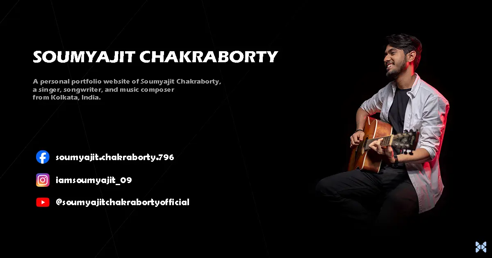

# **Soumyajit Chakraborty - Portfolio**

A personal portfolio website of Soumyajit Chakraborty, a singer, songwriter, and music composer from Kolkata, India.



## Who is Soumyajit Chakraborty?

Soumyajit Chakraborty is a singer, songwriter, and music composer from Kolkata, India. He is a versatile singer who has sung in various languages including Bengali, Hindi and English. He has been a part of the music industry for more than 5 years and has worked with some of the biggest names in the industry.

This is a personal portfolio website of Soumyajit Chakraborty. It is built using [Next.js](https://nextjs.org/) and [Tailwind CSS](https://tailwindcss.com/).

## Getting Started

-   First, clone the repository:

    ```bash
    git clone https://github.com/itsdrvgo/soumyajit-portfolio
    ```

-   Install the dependencies:

    ```bash
    npm install
    # or
    yarn install
    # or
    pnpm install
    ```

-   Run the development server:

    ```bash
    npm run dev
    # or
    yarn dev
    # or
    pnpm dev
    ```

-   Open [http://localhost:3000](http://localhost:3000) with your browser to see the result.
-   You can start editing the page by modifying [`page.tsx`](<./src/app/(home)/page.tsx>). The page auto-updates as you edit the file.
-   Build the app for production:

    ```bash
    npm run build
    # or
    yarn build
    # or
    pnpm build
    ```

-   Run the production build:

    ```bash
    npm run start
    # or
    yarn start
    # or
    pnpm start
    ```

## License

This project is licensed under the [MIT License](./LICENSE). Feel free to use it however you like.

## Follow Soumyajit

[](https://instagram.com/iamsoumyajit_09)
[](https://youtube.com/@soumyajitchakrabortyofficial)
[](https://facebook.com/soumyajit.chakraborty.796)

## Credits

This project is created and maintained by [DRVGO](https://itsdrvgo.me).

[](https://instagram.com/itsdrvgo)
[](https://linkedin.com/in/itsdrvgo)
[](https://twitch.tv/itsdrvgo)
[](https://x.com/itsdrvgo)
[](https://youtube.com/@itsdrvgodev)
